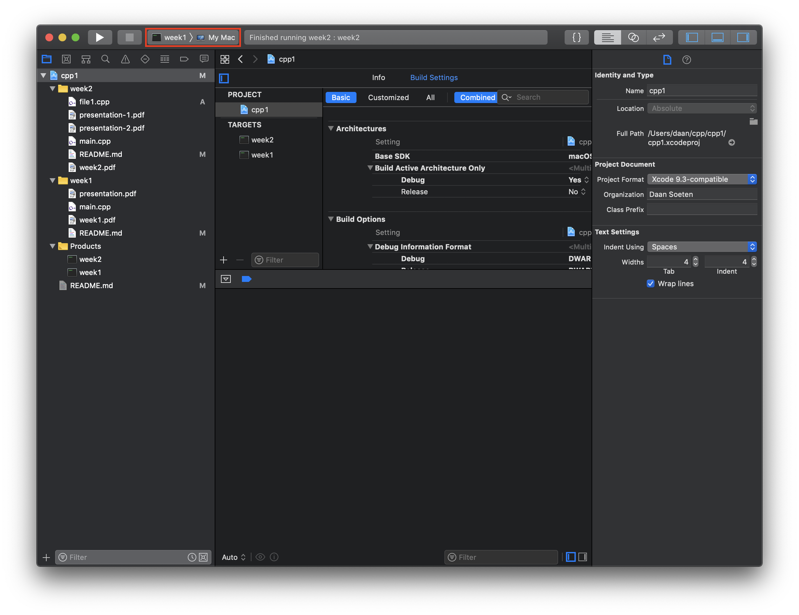

# CPP Homework Assignments
This repository covers the homework assignments done for the CPP1 Avans course, including links to reference material and learning resources I made use of. 

## The C++ Programming Language Book
In learning material provided by Avans, the book [The C++ Programming Language 4th Edition](The%20C++%20Programming%20Language%204th%20Edition.pdf) is referenced. 

## Index
- [Week 1](week1)
- [Week 2](week2)

## Usage Xcode
1. Open `cpp1.xcodeproj` using Xcode `> 10.3`.
2. Use the target switcher to switch between weeks: 

